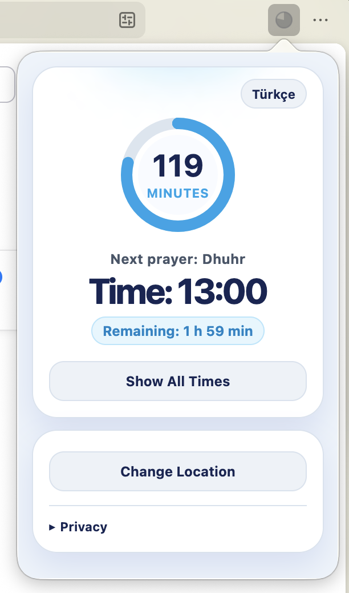
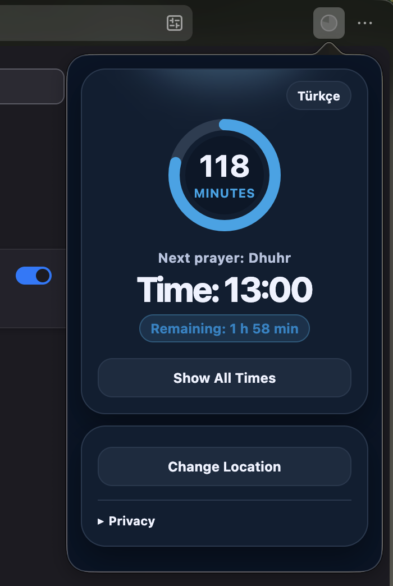
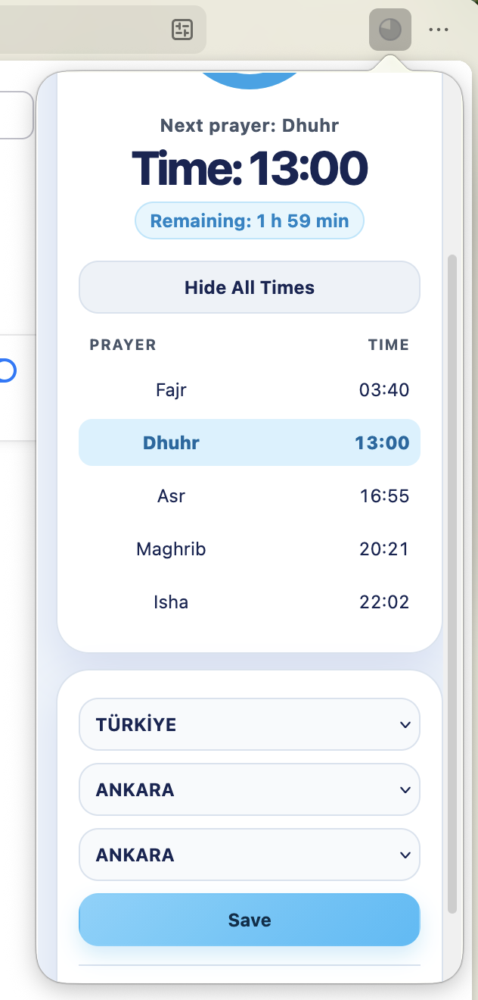

# Prayer Times – Browser Extension

**Prayer Times** is a lightweight extension for Zen Browser and Firefox that tracks Islamic prayer times based on your location and shows a visual countdown to the next salah in the toolbar.

The extension runs in the background and updates every minute.

---

## Screenshots

| Light theme | Dark theme | Prayer times and location |
|:---:|:---:|:---:|
|  |  |  |

---

## Features

- Countdown to the next prayer time
- Minimal progress icon in the toolbar
- Automatic updates every minute
- Location selection by country, province, and district
- Daily caching for fast performance
- Works without opening the popup
- English and Turkish UI (follows browser language)

---

## How It Works

- Prayer times are fetched from [prayertimes.api.abdus.dev](https://prayertimes.api.abdus.dev) (official Diyanet data)
- Daily times are cached in local storage
- The `alarms` API triggers updates every minute
- Icon fill reflects progress until the next prayer
- Tooltip shows remaining time (e.g. "2 h 30 min left")

---

## Install in Zen Browser

1. Clone this repository:
   ```bash
   git clone https://github.com/selimsezr/zen_salah_extension.git
   ```
2. Open `about:debugging` in Zen Browser
3. Click **This Zen** (or **This Firefox**)
4. Click **Load Temporary Add-on**
5. Select the `manifest.json` file from the cloned folder

---

## Publish to Zen Mods / Add-ons

This project is a **WebExtension** (not a CSS theme mod). To publish it:

1. **Firefox Add-ons (AMO)** – Recommended for wide distribution. Submit the packaged `.zip` at [addons.mozilla.org](https://addons.mozilla.org).
2. **Self-hosted** – Share the repository or a release `.zip` for manual installation.

For the Zen Mods store (`zen-browser.app/mods`), only CSS/JS theme mods are accepted. This extension should be published as an add-on instead.

### Publishing checklist

- [x] English and Turkish localization (`_locales/en`, `_locales/tr`)
- [x] Extension name and description in `messages.json`
- [x] `default_locale` set in `manifest.json`
- [ ] Add icons (48px and 96px recommended for AMO)
- [ ] Create a release `.zip` excluding `.git`

Package for submission:
```bash
zip -r prayer-times.zip . -x "*.git*" -x "*.DS_Store"
```

---

## Language

The UI language follows your browser setting:

| Browser language | UI |
|------------------|-----|
| `tr`, `tr-TR`    | Turkish |
| Everything else | English (default) |

---

## License

See [LICENSE](LICENSE).
